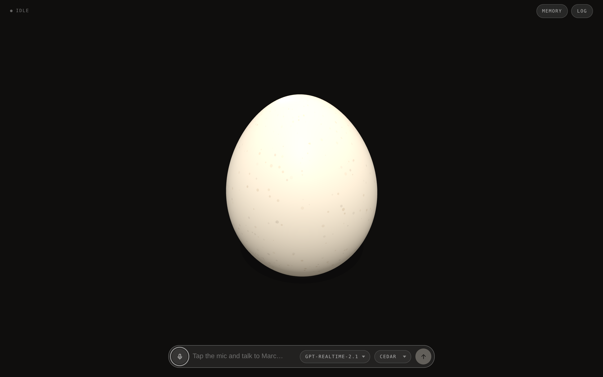
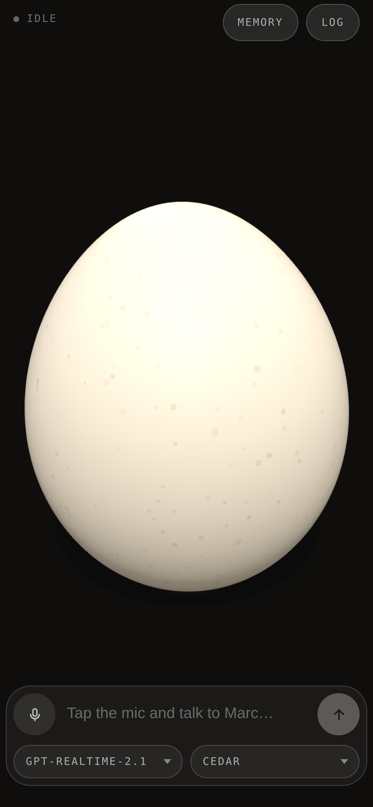

# Marc

A voice agent rendered as an egg. Marc is speckled and cream-shelled: he rocks
where he stands, lies down and spins like a hard-boiled egg while he thinks, and
squashes in time with whoever is making sound — all of it driven by a live
OpenAI Realtime call. He remembers what you tell him to, between calls.



<p align="center">
  
</p>

## Run

```sh
git clone https://github.com/h1ddenpr0cess20/marc
cd marc
npm install
cp .env.example .env      # add your OPENAI_API_KEY
npm run dev               # → http://localhost:5173
```

Click the mic, allow the browser's microphone prompt, and start talking.

The mic button is a microphone switch, not a hang-up: turning it off stops what
you send and leaves the answer playing, and the conversation is still there when
you turn it back on. It also switches itself off after a minute of silence, and
the call survives that too.

| Script | |
|---|---|
| `npm run dev` | Vite, with the proxy mounted as middleware — one process |
| `npm run dev:lan` | The same, over HTTPS on the network — for a phone |
| `npm run build` | Bundles the client to `dist/` |
| `npm start` | Serves `dist/` with the same proxy in front |
| `npm run preview` | `build` then `start` |
| `npm run preview:lan` | `build` then `start`, over HTTPS on the network |
| `npm test` | `node:test` over the server |
| `npm run lint` | ESLint |

CI runs the lint, the tests on Node 22.12 and 24, and a build that then has to
boot and serve itself over both HTTP and HTTPS.

## Configuration

Both `npm run dev` and `npm start` read `.env`.

| Variable | Default | Role |
|---|---|---|
| `OPENAI_API_KEY` | — | Required. Stays in the Node process. |
| `MEMORY` | `true` | The `remember` and `forget` tools, and the memory block in the prompt |
| `OPENAI_VOICE` | `cedar` | Which voice the picker opens on (`cedar`, `ballad`, `ash`, `echo`, `verse`) |
| `OPENAI_REALTIME_MODEL` | `gpt-realtime-2.1` | Preselected in the picker when the key can reach it |
| `OPENAI_BASE_URL` | OpenAI | Points the proxy at a gateway or a stub |
| `PORT` | `5173` | |
| `SSL_KEY`, `SSL_CERT` | — | Paths to a real certificate; `npm start` then serves HTTPS |

The voice picker lists male voices only — Marc has one voice range, and changing
it mid-conversation would make him a different character between turns. `cedar`
is the default: realtime-native, and the most naturalistic of them. `ballad` has
a drier lift; `ash`, `echo` and `verse` predate cedar and read flatter. An
`OPENAI_VOICE` outside that list is still honoured and joins the picker at the
front — the list in `src/server/config.js` goes stale, the API doesn't.

### On a phone

```sh
npm run dev:lan           # → https://192.168.x.x:5173, printed on start
```

Microphone access needs a secure context. `localhost` is one; a LAN address over
plain HTTP is not — `navigator.mediaDevices` doesn't exist there, so the page
can't even raise the mic prompt. The `:lan` scripts serve HTTPS with a
self-signed certificate, cached in `node_modules/.vite/`.

No browser trusts that certificate, so the phone shows a warning the first time
("Advanced" → proceed on Chrome, "Show details" → "visit this website" on
Safari). Tap through it once per device. To skip it, point `SSL_KEY` and
`SSL_CERT` at a certificate the device already trusts —
[mkcert](https://github.com/FiloSottile/mkcert) issues one for a LAN IP.

## Docker

```sh
docker run --rm -p 5173:5173 -e OPENAI_API_KEY=sk-... h1ddenpr0cess20/marc
```

Images go to Docker Hub on every push to `main` (`latest`) and on `v*` tags
(`1.2.3`, `1.2`), for `linux/amd64` and `linux/arm64`. Configuration is the same
set of variables as `.env` — pass them with `-e` or `--env-file .env`.

The container serves HTTP on `PORT` and expects TLS to be terminated in front of
it; to serve TLS from the container, mount a certificate and set `SSL_KEY` and
`SSL_CERT`. Build it yourself with `docker build -t marc .`. Publishing from a
fork needs a `DOCKERHUB_TOKEN` secret, plus a `DOCKERHUB_USERNAME` variable if
your Docker Hub account isn't `h1ddenpr0cess20`.

## How the call is wired

The API key never reaches the browser, and the audio never reaches the proxy:

1. The page asks `POST /api/session` for a client secret, naming the model and
   voice it wants and sending whatever it has in memory. The proxy mints one
   from `/v1/realtime/client_secrets` with the persona, memories, voice, tool
   list and turn detection already attached, valid for ten minutes.
2. The page opens an `RTCPeerConnection`, adds the mic track, and POSTs its SDP
   offer straight to `/v1/realtime/calls` with that secret.
3. Audio flows browser ↔ OpenAI over WebRTC. Events flow over an `oai-events`
   data channel alongside it.

Turn-taking is server-side semantic VAD, so barge-in is free: speak over Marc and
the model truncates its own playback. `Escape` cancels the current response for
the typed path.

The picker lists every realtime model the key can reach, minus the ones that
can't hold a conversation — the `translate` and `whisper` tiers are streaming
translation and speech-to-text. Both pickers are pinned into the client secret,
so changing the model or the voice mid-call hangs up and dials again, and the
conversation doesn't carry over.

The proxy is connect-style middleware rather than a server, so there's only one
implementation of `/api/*`: `vite.config.js` mounts it in development and
`src/server/app.js` mounts it in front of the static handler in production. No
second process, and the key lives in one place either way.

## History

Every completed turn is written to `localStorage` under `marc.history.v1`, one
record per call, and the `log` button in the composer opens them newest first.
`new` closes the record and, if a call is up, dials again — the model's memory of
what was said is the call itself, so a new call is the only thing that clears it.

Nothing is uploaded: audio already goes straight to OpenAI without passing
through the proxy, and the transcript doesn't go even that far. `clear`, which
asks once, removes it. The last 40 conversations are kept, and the oldest are
shed to stay inside a 300 KB budget, since that space belongs to the whole
origin. Private-mode Safari hands back a store that throws on write, so the log
falls back to memory for the life of the page rather than failing the call.

Old turns are not replayed into a new call. That would make the log a memory
rather than a record, which is a different feature than keeping one.

## Tools

Marc has no tools beyond memory. He answers from what the model already knows:
no web search, no retrieval. Ask him about this morning and he should say he
doesn't know, which is what the system prompt asks for.

The two exceptions are `remember` and `forget`, which the page executes itself
against browser storage. Remote MCP servers, which the Realtime API executes on
its own, would be a few lines in the same place: `sessionConfig()` in
`src/server/persona.js` already builds the tool list, and anything needing auth
headers stays in the server-side `/v1/realtime/client_secrets` payload rather
than in the page.

## Memory

The log is a record. Memory is what Marc carries into the next call: a short
list of details, kept in `localStorage` under `marc.memory.v1` and appended to
the persona as a labelled block when the secret is minted.

Ask him to remember something and he calls `remember`; ask him to forget it and
he calls `forget`, which drops every stored line matching the keyword. Both run
in the page: the model's call arrives on the data channel as
`response.function_call_arguments.done`, the page answers it against
`localStorage`, and the result goes back as a `function_call_output` followed by
a `response.create`. Without that second frame the model waits forever on its
own tool.

The `memory` button opens the list, where you can add a line by hand, drop one,
switch the whole thing off, or clear it. The list is capped at 25 lines, each
flattened to one line and cut at 600 characters; past the cap the oldest goes.

Editing the list by hand takes effect on the next call rather than the current
one — the instructions are baked into the client secret, and the page has no
copy of the persona to re-send with. A `remember` the model makes mid-call needs
no such round trip: it already knows what it just stored, because the tool
result said so.

Nothing is uploaded to us — the list rides in the `POST /api/session` body,
which is the same request that already names the model and voice, and the proxy
keeps no copy. `MEMORY=false` removes both the tools and the prompt block for
everyone the server serves.

Memories are text the person typed or dictated, so they land inside the prompt.
Flattening and capping them in `persona.js` keeps a memory from opening a new
instruction paragraph, and the persona is always first in the string.

## States

`idle` · `listening` · `thinking` · `speaking` — each a set of targets for
jitter, lean, rock, roll, spin and squash. Marc eases between them, so
transitions read as the same egg changing mood rather than a cut.

- **idle** — rocks where he stands, with a fidget every few seconds.
- **listening** — leans in and settles, rocking a little quicker.
- **thinking** — lies down and spins like a hard-boiled egg. It's the one pose
  the other three never take, which is what makes the state legible at a glance.
- **speaking** — rolls a short arc and back, squashing on every syllable.

The call maps onto them directly: `listening` from `speech_started` and between
turns, `thinking` from `speech_stopped` until the first audio frame, `speaking`
while the model's track is live, `idle` when there is no call.

Three nested groups keep those motions from fighting: the outer one carries world
tilt and tremor, the middle one spins about world up, and the inner one owns the
lie-down, the roll and the squash.

## Layout

```
Dockerfile              Build the client, then serve it from src/server
index.html              Markup only — Vite's entry
src/
  client/
    main.js             The wiring, and nothing else
    styles.css          The HUD around Marc
    api.js              The proxy's two endpoints, as functions
    history.js          Past conversations, in localStorage
    memory.js           What it remembers between calls, in localStorage
    egg/                Geometry and animation. Knows nothing about transports
      index.js            The controller and the per-frame loop
      moods.js            Targets per conversational state
      motion.js           The spring and the chase every channel eases on
      shell.js            The egg profile, and the material that wears the skin
      skin.js             Speckled cream, painted once onto a canvas
      environment.js      Warm studio env, so the shell reads as ceramic
    session/            The call. Emits transport-agnostic events
      index.js            Lifecycle: mic, secret, connect, meter, tear down
      webrtc.js           Peer connection, data channel, SDP handshake
      events.js           Realtime server events → this vocabulary
      tools.js            remember/forget, run in the page
      metering.js         Two analysers → one 0..1 number per frame
      emitter.js
    ui/
      hud.js              Status chip, transcript, caption
      history.js          The log panel behind the `log` button
      memory.js           The memory panel behind the `memory` button
      controls.js         Mic, text field, send, pickers
      viewport.js         Keeps the composer above the on-screen keyboard
    vendor/
      three-d-stage.js    Starter component (renderer, lighting, camera, controls)
  server/
    index.js            Entry point
    app.js              The middleware chain
    api.js              /api/models + /api/session
    openai.js           The two calls it makes
    persona.js          Who Marc is, and the session config
    config.js           The environment, resolved once
    static.js           Hosting for dist/ — production only
docs/                   Policies, and the screenshots above
test/                   node:test, against a stub OpenAI
.github/workflows/      CI (lint, tests, build smoke test) and the Docker publish
```

`src/client/vendor/three-d-stage.js` is a copied starter component with two
local changes, listed at the top of the file — re-copying it drops them.

## The transport seam

`session/index.js` exposes `on`, `start`, `stop`, `send`, `cancel`, `messages`,
`connected`, `busy`, `stale`, `state`, `muted`, `model`, `voice` — and emits:

```
'state'   listening | thinking | speaking | idle
'text'    a chunk of assistant transcript
'tool'    a label while a tool works, or null
'memory'  the result of a remember/forget the model just called
'user'    a completed transcript of what the person said
'level'   0..1 sustained amplitude, per frame
'pulse'   0..1 transient, one per discrete event
'message' a completed turn, { role, content } — what the log stores
'busy'    whether a response is in flight
'done'    { model, usage }
'error'   { message }
```

Marc takes audio-shaped input:

```js
marc.setState('speaking')  // idle | listening | thinking | speaking
marc.setLevel(0.62)        // sustained amplitude 0..1, sampled per frame
marc.pulse(0.4)            // transient impulse 0..1, one per discrete event
```

Both land on the same internal energy value. `setLevel` carries the voice — two
`AnalyserNode`s, one on the mic and one on the model's track, read per frame and
smoothed with a fast attack and a slow release. `pulse` is for the beats where a
turn changes hands: it kicks the springs directly as well as the energy, so the
squash punctuates instead of strobing.

Swapping providers means writing a different `createVoiceSession()` with that
surface. `main.js` and the egg don't change.

## Policies

- [**AI Output Disclaimer**](docs/ai-output-disclaimer.md) — what the model says
  is the model's, not the author's, plus the risks that are specific to a live
  microphone and speech you hear before anyone can check it.
- [**Not a Companion**](docs/not-a-companion.md) — Marc is a toy and a demo.
  It is not a friend, a therapist, or a partner, and the project will not grow in
  that direction.
